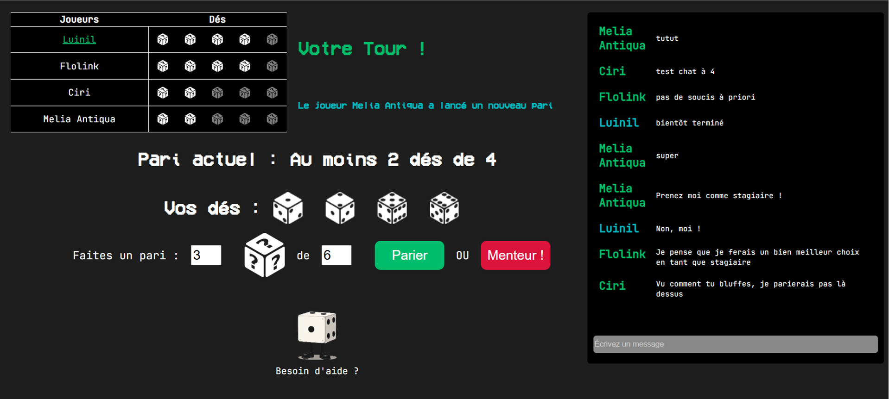
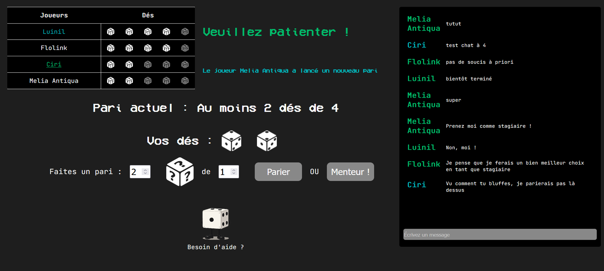
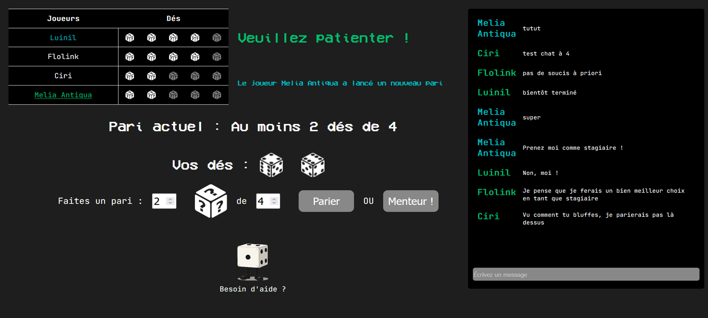

# Jeu multijoueur en ligne – Le dé menteur

## Contexte
Projet scolaire réalisé en autonomie dans le cadre de la formation IFAPME.

## Objectif du projet
Développer un **jeu multijoueur en ligne**, jouable à plusieurs (2 à 6 joueurs),
avec gestion des parties, des tours de jeu, d’un classement et d’un chat en temps réel.

Le projet visait à mettre en pratique :
- la communication front-end / back-end
- la gestion d’état côté serveur
- la conception d’une base de données relationnelle

## Aperçu

  
  

  
  

  
  

## Règles du jeu (résumé)
Le jeu est une adaptation du **dé menteur**, jouable de 2 à 6 joueurs.

- Chaque joueur commence avec 5 dés (points de vie)
- Les joueurs jouent à tour de rôle en faisant un pari sur les dés
- Le joueur suivant peut surenchérir ou accuser le précédent de « menteur »
- Le joueur perdant le duel perd un dé
- Un joueur sans dés est éliminé
- La partie se termine lorsqu’il ne reste qu’un joueur
- Des points de classement sont attribués en fin de partie

Les règles en détails se trouvent [ici](RULES.md)

## Fonctionnalités principales
- Création et rejoindre des parties multijoueurs
- Système de **lobby** avant le lancement d’une partie
- Gameplay **tour par tour**
- Gestion des paris, éliminations et duels finaux
- **Chat en temps réel** lié à chaque partie
- Système de **points et de classement (Eliar)**
- Historique des parties et affichage des résultats
- Authentification et gestion des comptes joueurs

## Architecture & logique
- Interface front-end dynamique en HTML / CSS / JavaScript
- Communication avec le serveur via **API PHP** et échanges **JSON**
- Rafraîchissement automatique de l’état du jeu (polling)
- Gestion des états de partie (créée | en cours | terminée)
- Base de données relationnelle pour :
  - joueurs
  - parties
  - lobby
  - messages

## Technologies utilisées
- HTML / CSS
- JavaScript
- PHP
- SQL (MySQL)
- JSON
- phpMyAdmin
- Git

## Ce que ce projet m’a apporté
- Conception d’une application web complète
- Gestion d’une logique de jeu multijoueur
- Structuration d’une API simple
- Modélisation d’une base de données relationnelle
- Renforcement des compétences front-end et back-end
